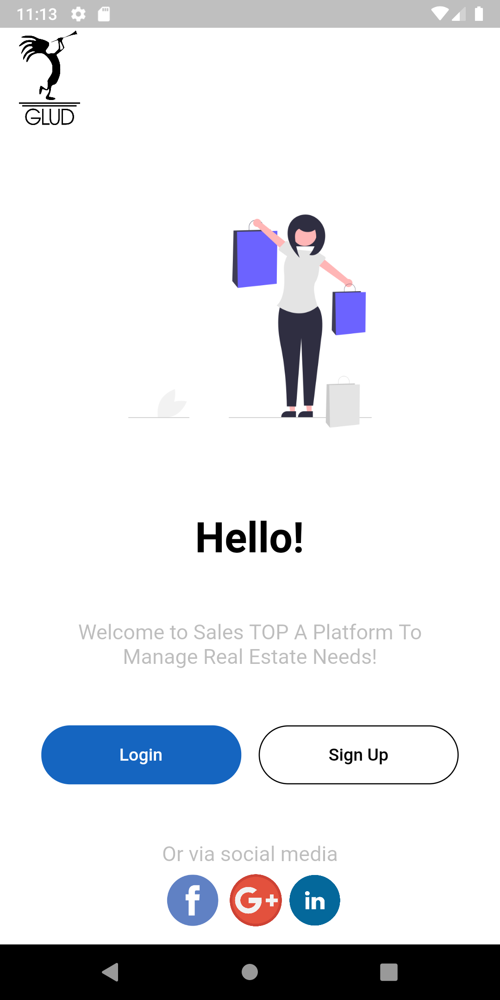

# Ui Clone of the Nequi application

This design has been created for educational purposes. 
Also this project has integrated push notifications with firebase and my own server in python.

if u want to try just put the app in background mode and search this in your browser 
https://juansuarezz-servidorflask.zeet.app/message

Final Result.

## Getting Started

Just git clone and update the proyect with flutter pub get
